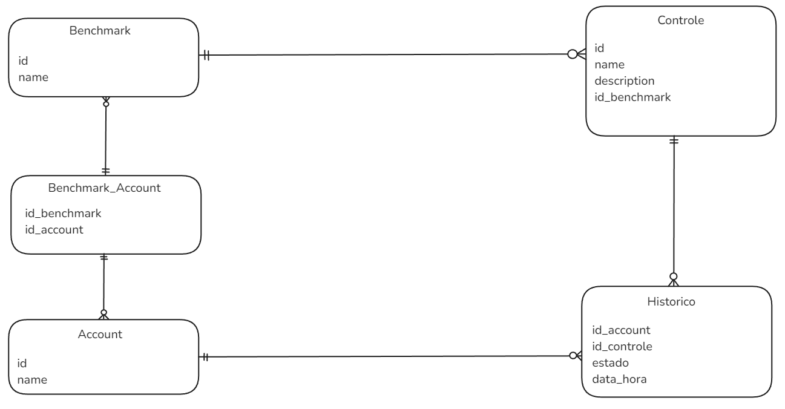

# MER

# Cenário Q1

Listar Benchmark com seus Controles e o estado atual para uma Account.

### Índice recomendado:

- idx_historico_account_control (id_account, id_controle, data_hora DESC)

### Porque:

Com esse índice é possível realizar uma busca otimizada na tabela **Historico** pelo horário mais recente, identificando assim, sempre o último estado de um controle. Assim, criando um índice para essa parte mais custosa da consulta e fazendo um **SELECT** com o Benchmark utilizando o índice.

# Cenário Q2

Listar Benchmark com seus Controles e as mudanças de estado em um intervalo para uma Account.

### Índice recomendado:

- idx_historico_account_data (id_account, data_hora)
- Utilizar **BETWEEN** para query

### Porque:

Com esse índice é possível realizar uma busca otimizada direto na tabela de **Historico**, a partir de uma **Account**, onde se evita uma varredura completa no banco de dados. Além de utilizar o **BETWEEN** para filtrar o intervalo de data que ocorreram mudanças.

# Cenário Q3

Obter Benchmark com seus Controles e o estado em uma data/hora X (snapshot) para uma Account.

### Índice recomendado:

- idx_historico_account_data_control (id_account, id_controle, data_hora DESC)
- Utilizar **WHERE** com uma data menor ou igual que a do snapshot
- Utilizar **GROUP BY** para agrupar por determinados controles.

### Porque:

Com esse índice é possível realizar uma busca otimizada na tabela **Historico** utilizando o **id_account** e percorrer **data_hora** em ordem decrescente. Onde permite encontrar o registro de estado mais recente para cada **id_controle** que seja menor ou igual que o snapshot. Com o **GROUP BY** e o índice, garante assim, a busca sem precisar escanear toda a tabela.
